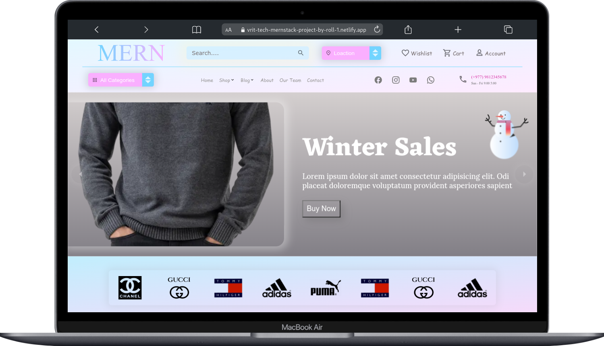

# Reactjs E-commerce UI

[Live Demo](https://vrit-tech-mern-project-by-tejkarki.netlify.app/).

## Icons

on this project i used [Material UI Icons](https://mui.com/material-ui/material-icons)

## images

promptbase ai generated images [marketplace](https://promptbase.com/marketplace?categories=clothes)
& [illustrations](https://icons8.com/illustrations)

[Generate linear gradient cssgradient](https://cssgradient.io/)

[Mobile simulator - responsive testing tool extensions](https://chrome.google.com/webstore/detail/mobile-simulator-responsi/ckejmhbmlajgoklhgbapkiccekfoccmk)

## React main file [index.js](https://github.com/NGR-NP/mern-stack-course/blob/E-commerce-ui/src/index.js)

This Project is a React application that utilizes the Redux library to manage state and the Redux Persist library to persist the state to local storage. The main file, index.js, serves as the entry point for the applicaton.

1. The application is wrapped in a React.StrictMode components for improved debgugging and performance, and the Redux Provider is used to provide the store to the rest of the application.

2. The PersistGate component is used to persist the state of the store to local storage, and the App component is passed as the child to the rendered with the PersistGate. 
 

### React RouterProvider [App.js](https://github.com/NGR-NP/mern-stack-course/blob/E-commerce-ui/src/App.js)

[canva slides](https://www.canva.com/design/DAFYyzTjL5I/71o0gL47Z9NUXYrz-yIBgA/edit?utm_content=DAFYyzTjL5I&utm_campaign=designshare&utm_medium=link2&utm_source=sharebutton)

## Learn More

You can learn more in the [Create React App documentation](https://facebook.github.io/create-react-app/docs/getting-started).

To learn React, check out the [React documentation](https://reactjs.org/).

### Code Splitting

This section has moved here: [https://facebook.github.io/create-react-app/docs/code-splitting](https://facebook.github.io/create-react-app/docs/code-splitting)

### Analyzing the Bundle Size

This section has moved here: [https://facebook.github.io/create-react-app/docs/analyzing-the-bundle-size](https://facebook.github.io/create-react-app/docs/analyzing-the-bundle-size)

### Making a Progressive Web App

This section has moved here: [https://facebook.github.io/create-react-app/docs/making-a-progressive-web-app](https://facebook.github.io/create-react-app/docs/making-a-progressive-web-app)

### Advanced Configuration

This section has moved here: [https://facebook.github.io/create-react-app/docs/advanced-configuration](https://facebook.github.io/create-react-app/docs/advanced-configuration)

### Deployment

This section has moved here: [https://facebook.github.io/create-react-app/docs/deployment](https://facebook.github.io/create-react-app/docs/deployment)

### `npm run build` fails to minify

This section has moved here: [https://facebook.github.io/create-react-app/docs/troubleshooting#npm-run-build-fails-to-minify](https://facebook.github.io/create-react-app/docs/troubleshooting#npm-run-build-fails-to-minify)