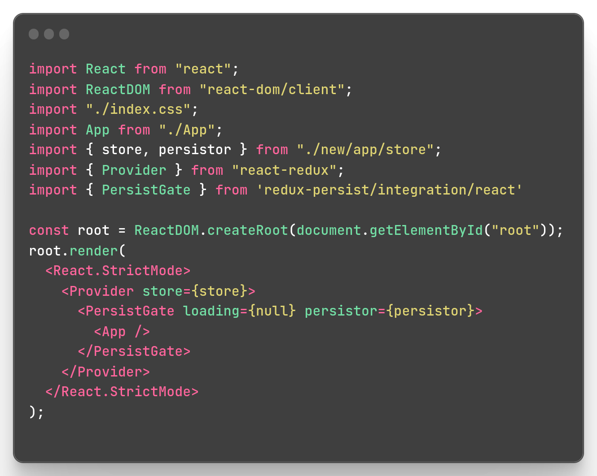
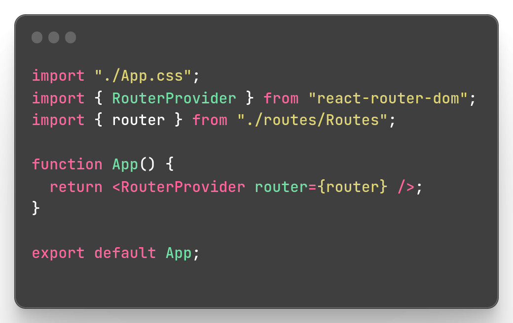
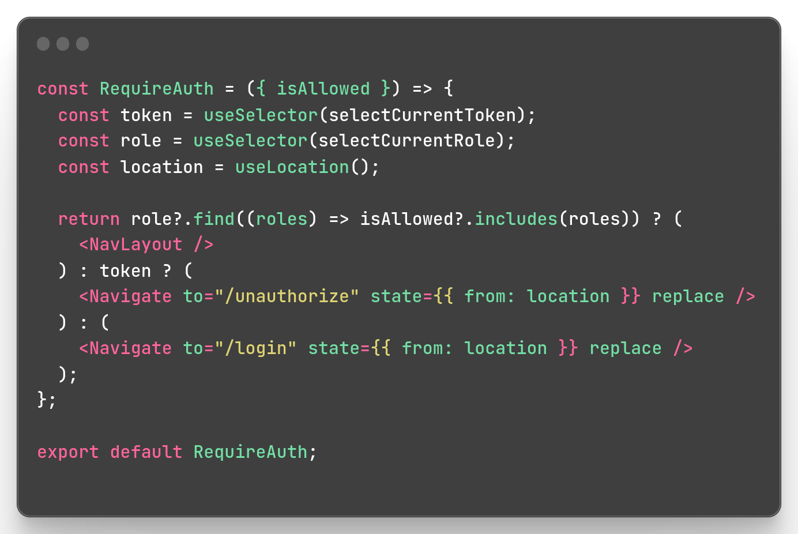

# Reactjs E-commerce UI

[Live Demo](https://vrit-tech-mern-project-by-tejkarki.netlify.app/).

## Icons

on this project i used [Material UI Icons](https://mui.com/material-ui/material-icons)

## images

promptbase ai generated images [marketplace](https://promptbase.com/marketplace?categories=clothes)
& [illustrations](https://icons8.com/illustrations)

[Generate linear gradient cssgradient](https://cssgradient.io/)

[Mobile simulator - responsive testing tool extensions](https://chrome.google.com/webstore/detail/mobile-simulator-responsi/ckejmhbmlajgoklhgbapkiccekfoccmk)

## React main file, [(index.js)](https://github.com/NGR-NP/mern-stack-course/blob/E-commerce-ui/src/index.js)

This Project is a React application that utilizes the Redux library to manage state and the Redux Persist library to persist the state to local storage. The main file, index.js, serves as the entry point for the applicaton.

1. It starts by importing the required libraies and components, including the App components, the `Redux store` and the `persistor`. The store andd persistor and imported from the `"./new/app/store"` file.

2. a ReactDOM root is created using the document.getElementById method and the render method is used to render the application.

3. The application is wrapped in a `React.StrictMode` components for improved debgugging and performance, and the `Redux Provider` is used to provide the store to the rest of the application.

4. The `PersistGate` component is used to persist the state of the store to local storage. This means that the state of the application will persist even after a page refresh or if the user closes the application. The `PersistGate` component takes in the `persistor`, which is also imported from the `"./new/app/store"` file. The `persistor` is responsible for persisting the state of the store to local storage.
 

### React RouterProvider [(App.js)](https://github.com/NGR-NP/mern-stack-course/blob/E-commerce-ui/src/App.js)

The RouterProvider component provides the routing functionality to the application and the `"router"` object has a specific path and is associated with a specific component that will be rendered when that path is accessed. For example, a route with a path of `"/"` might be associated with a Home component that will be rendered when the user accesses the root of the application. Another route with a path of `"/about"` might be associated with an About component that will be rendered when the user accesses the `"/about"` page of the application.

The `RouterProvider` component provides the routing functionality to the application and The `"router"` object is passed as a prop to the `RouterProvider` component in the App component. This allows the `RouterProvider` component to have access to the different routes defined in the `"router"` object and to render the appropriate component when a specific path is accessed.

### CreateBrowserRouter [(Routes.js)](https://github.com/NGR-NP/mern-stack-course/blob/E-commerce-ui/src/routes/Routes.js)

By defining the routes in a separate file and importing them into the App components, it makes it easier to manage and maintain the structure of the application. Any changes to the routes can be made in the `"./routes/Routes"` file, and will be reflecated in the rest of the application without having to make changes in the multiple palces;

on createBrowserRouter i had define the different routes in the project. The `router` boject is created using the `createBrowserRouter` function and it contains different path for the Website, such as `/login`, `/register`, `/`. `/admin`, etc. Each path has a corresponding component, such as `loginPage`, `registerpage`, `Homepage`, `Adminpage`, etc . that will dbe display on the page when the corresponding path is visited.

### All Routes [Routes.js](https://github.com/NGR-NP/mern-stack-course/blob/E-commerce-ui/src/routes/Routes.js)

This code defines the different routes or pages in the project. The "router" object is created using the `"createBrowserRouter"` function and it contains different paths for the website, such as `"/login"`, `"/register"`, `"/"`, `"/admin"`, etc. Each path has a corresponding component, such as `"LoginPage"`, `"Register"`, "`Home"`, `"Admin"`, etc., that will be displayed on the page when the corresponding path is visited.

The code also has a feature for role-based authorization, where only users with specific roles are allowed to access certain pages. For example, the "RequireAuth" component is used to only allow users with the role of `ADMIN` to access the `"/admin"` and "`/new"` pages. Similarly, users with the role of `USER` are allowed to access the `"/profile"` and `"/checkout"` pages.

The `"ROLE"` object defines the different roles, such as `ADMIN` and `USER`, that a user can have. In case a user tries to access a page they are not authorized to, they will be redirected to the `"/unauthorize"` page. If the user tries to access a path that doesn't exist, they will be show `"404 page not found"` page.

### Authorization Checker [RequireAuth.js](https://github.com/NGR-NP/mern-stack-course/blob/E-commerce-ui/src/new/auth/RequireAuth.js)

`"RequireAuth"` component acts as an authorization checker for different pages/routes in the application. It uses the "useSelector" hook from "react-redux" to access the token and role stored in the Redux store. The "isAllowed" prop passed to this component is an array of allowed roles that are allowed to access the current page.

The components checks if the current user's role is included in the `isAllowed` props array. If it is, the user is allowed to access the page and the `NavLayout` components is rendered. If the user's role is not allowded, the components checks if the user has a token.if they has a token, they are redirected to the `unauthorized` page. If they don't have a token, they are redirected to the `login` page.

this application also has feature for role-based authorization, where only users with specific roles are allowed to assess certain pages. 
For example,

the `RequireAuth` component is used to only allow user with the Role of ADMIN to access the `/admin' and '/new` pages.

similary,

users with the role of USER are allowed to access the `/profile` and `/checkout` pages

### check user is loggedin or not as well as their role [(RequireAuth.js)](https://github.com/NGR-NP/mern-stack-course/blob/E-commerce-ui/src/new/auth/RequireAuth.js)

`RequireAuth` component which acts as an authorization checker for different routes in the application. it uses the `useSelector` hook from `react-redux` to access the token and role stored in the `Redux store`. THe `iisAllowed` prop passed to this component is an array of allowed roles that are allowed to access the current pages.

The component also checks if the current user's role is included in the `"isAllowed"` props array. if  it is, the user is allowed to access the page. If the user's role is not included in `"isAllowed"` props array, the component checks if the user has a token. If they have a token , they are redirected to the `"unauthorized"` page. If they don't have a token, They are redirected to the `"login"` page.

[canva slides](https://www.canva.com/design/DAFYyzTjL5I/71o0gL47Z9NUXYrz-yIBgA/edit?utm_content=DAFYyzTjL5I&utm_campaign=designshare&utm_medium=link2&utm_source=sharebutton)

## Learn More

You can learn more in the [Create React App documentation](https://facebook.github.io/create-react-app/docs/getting-started).

To learn React, check out the [React documentation](https://reactjs.org/).

### Code Splitting

This section has moved here: [https://facebook.github.io/create-react-app/docs/code-splitting](https://facebook.github.io/create-react-app/docs/code-splitting)

### Analyzing the Bundle Size

This section has moved here: [https://facebook.github.io/create-react-app/docs/analyzing-the-bundle-size](https://facebook.github.io/create-react-app/docs/analyzing-the-bundle-size)

### Making a Progressive Web App

This section has moved here: [https://facebook.github.io/create-react-app/docs/making-a-progressive-web-app](https://facebook.github.io/create-react-app/docs/making-a-progressive-web-app)

### Advanced Configuration

This section has moved here: [https://facebook.github.io/create-react-app/docs/advanced-configuration](https://facebook.github.io/create-react-app/docs/advanced-configuration)

### Deployment

This section has moved here: [https://facebook.github.io/create-react-app/docs/deployment](https://facebook.github.io/create-react-app/docs/deployment)

### `npm run build` fails to minify

This section has moved here: [https://facebook.github.io/create-react-app/docs/troubleshooting#npm-run-build-fails-to-minify](https://facebook.github.io/create-react-app/docs/troubleshooting#npm-run-build-fails-to-minify)